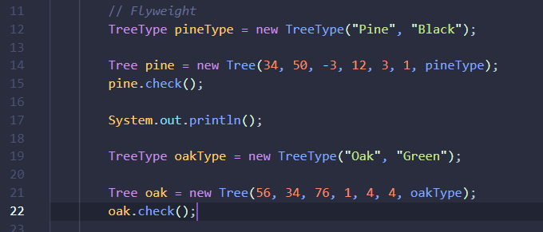
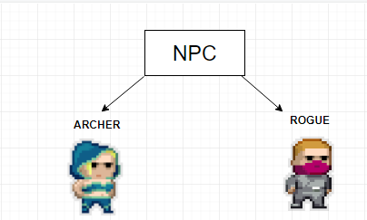
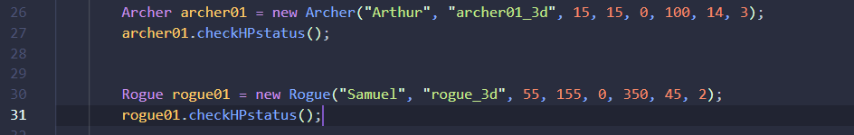
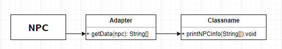

# Лабораторная работа №2
_Подготовила студентка группы TI-164, Рябинина Алиса_

## Задание 💠
Целью данной лабораторной работы было имплементировать 5 структурных паттернов.

## Использованные структурные паттерны 📓
1. _Adapter_
2. _Bridge_
3. _Facade_
4. _Flyweight_
5. _Proxy_

## _Adapter_
Адаптер — это структурный паттерн проектирования, который позволяет объектам с несовместимыми интерфейсами работать вместе.


## _Bridge_
Мост — это структурный паттерн проектирования, который разделяет один или несколько классов на две отдельные иерархии — абстракцию и реализацию, позволяя изменять их независимо друг от друга.


## _Facade_
Фасад — это структурный паттерн проектирования, который предоставляет простой интерфейс к сложной системе классов, библиотеке или фреймворку.


## _Flyweight_
Легковес — это структурный паттерн проектирования, который позволяет вместить бóльшее количество объектов в отведённую оперативную память. Легковес экономит память, разделяя общее состояние объектов между собой, вместо хранения одинаковых данных в каждом объекте.


## _Proxy_
Заместитель — это структурный паттерн проектирования, который позволяет подставлять вместо реальных объектов специальные объекты-заменители. Эти объекты перехватывают вызовы к оригинальному объекту, позволяя сделать что-то до или после передачи вызова оригиналу.


## Реализация 📝


Идея приложения: имитировать  структуру компьютерной игры 🔥Pixel Dungeon🔥.

Для реализиции сохранения ресурсов был использовал паттерн Flyweight.
Со структурной точки зрения каждое дерево состоит из параметров, которые постоянно повторяются, поэтому для экономии ресурсов можно указывать ссылку на обьект, который имеет все эти свойства.

Был создан тип дерева, а после создаёся обьект дерева с параметрами, где один из них - ссылка на тип дерева.

```
TreeType oakType = new TreeType(String name, String color);
Tree oak = new Tree(int x, int y, int z, int angleX, int angleY, int size, TreeType typeOfTree);
```
Пример:



Самый лучший шаблон для реализации NPC - Bridge, т.к появляется возможность расширять их свойства, и в то же время сохранять совместимость между ними, и компонентами которые работают с типом данных NPC.



В проекте есть тип данных NPC, в свойствах которого - имя персонажа, количество здоровья, его позиция в 3D пространстве (координаты x,y,z), атака, и метод checkHP который возвращает количество здоровья персонажа.

Были созданы два типа персонажей: Archer и Rogue, которые созданы на основе класса NPC



У них есть методы, которые проверяют количество здоровья, и реализована атака.

```
npc.checkHPstatus();
npc.attack(tree);
npc.attack(npc);
```
Метод getData получает параметры от  Npc и возвращает String List, чтобы его можно было использовать в printNPCInfo.
```
NPCInfo.printNPCInfo( Adapter.getData( npc ) );
```


Для шаблона Facade в проекте было создано множество классов, с параметрами которые формируют систему сохранений. Для создания обьекта Save, необходимо отослать обьекты World, Npc, Tress, History. Пользователи не имеют доступ к этой части программы, и им доступным только два метода - createSaveFile, и loadFromSaveFile.
```
Save save = Facade.SaveGame.createSaveFile();
LoadGame.loadFromSaveFile(save);
```
Также, в проекте была реализована имплементация облачных сохранений, при помощи шаблона Proxy. В проекте есть два класса: Server, и ProxyMod. Существует доступ только к proxyMod, который даёт возможность запросить Proxy загрузить файл сохранения с сервера, либо же загрузить его на сервер. 
```
ProxyMod.loadToServerSave(save);
```
